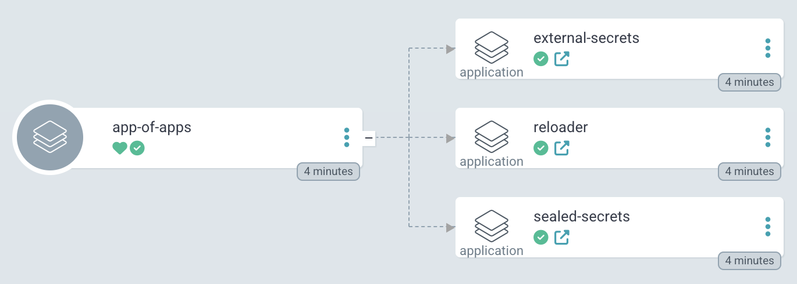
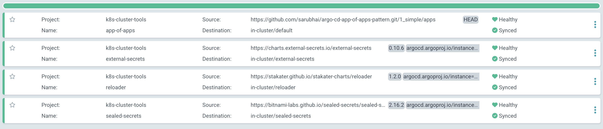
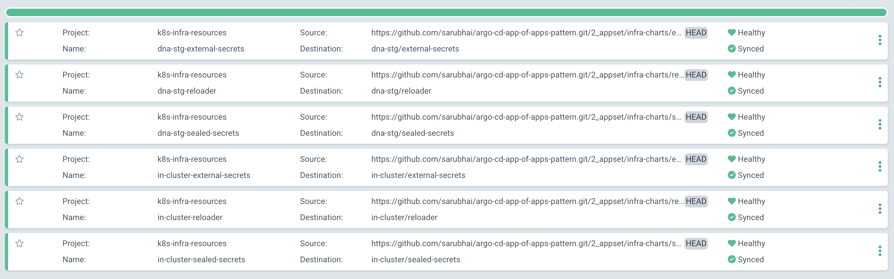
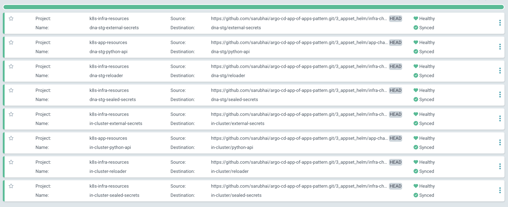
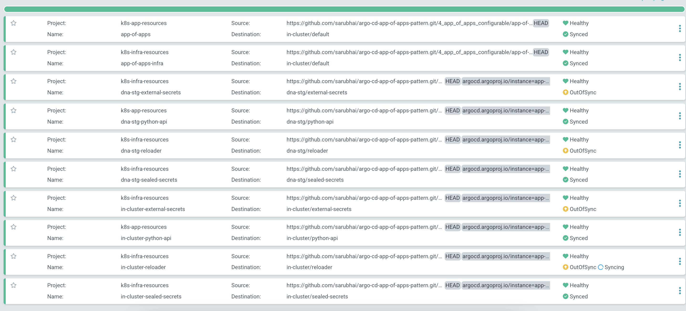
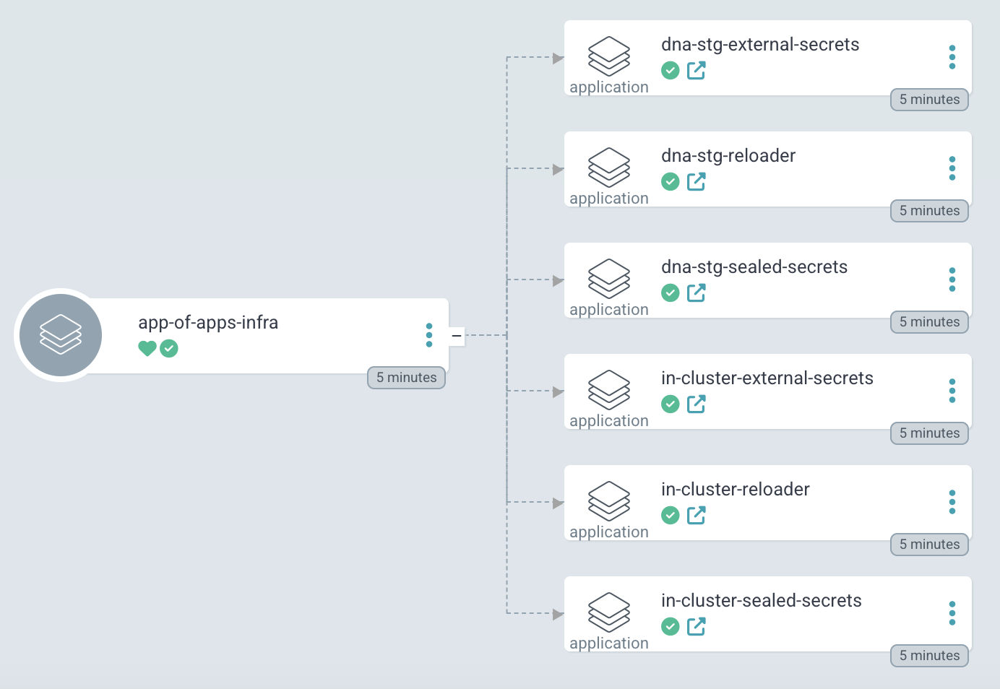
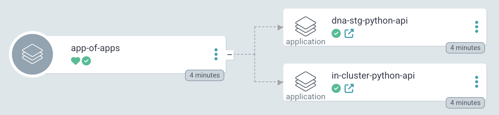

# ArgoCD App of Apps Pattern

This repository demonstrates multiple approaches to implementing the **App-of-Apps** pattern in ArgoCD. The App-of-Apps pattern is a powerful GitOps approach to managing applications in Kubernetes by using ArgoCD to deploy and manage other ArgoCD Application resources. This allows for the hierarchical management of applications across multiple environments.

## Kubernetes Resources
### Infra Charts
1. External Secrets
2. Sealed Secrets
3. Reloader
### Application Charts
1. Python API

## Repository Structure

The repository contains several examples that illustrate different variations of the App-of-Apps pattern:
1. simple

This is a basic example of the App-of-Apps pattern. It demonstrates:

- A root ArgoCD Application managing multiple child Applications.
- The simplicity of using YAML manifests to define dependencies.
- How ArgoCD automatically handles synchronization for applications defined in the parent app.

#### Simple App Of Apps


#### All Applications


Use this example as an introduction to the App-of-Apps concept and as a template for simple use cases.

2. appset

This example integrates the App-of-Apps pattern with ArgoCD ApplicationSets. It showcases:

- Automated creation of child Applications using a generator.
- Scalability to dynamically manage large numbers of applications with similar configurations.
- Support for progressive rollouts and automated updates across multiple clusters.

#### ApplicationSet


This setup is ideal for managing environments where configurations need to be templated and replicated.

3. appset_helm

Building upon 2_appset, this pattern introduces Helm templates for added flexibility. Features include:

- Helm charts to parameterize child Applications.
- Advanced templating capabilities for managing applications with shared configurations but unique values.
- Easier integration with external Helm chart repositories.

#### ApplicationSet With Environments Specific Values


This pattern is suited for complex use cases involving applications that require both dynamic generation and extensive parameterization.

4. app_of_apps_configurable

This advanced example demonstrates a fully configurable App-of-Apps pattern. It emphasizes:

- Centralized configuration for managing child Applications.
- High flexibility to define diverse deployment environments (e.g., development, staging, production).
- Customization options for individual applications through overrides.

#### App Of Apps With Highly Configurable Environments Specific Values


#### Configurable Infrastructure App Of Apps


#### Configurable Main App Of Apps


This configuration works well for teams managing diverse application environments with varying requirements.

## Advantages of the App-of-Apps Pattern
- Hierarchical Management: Simplifies application lifecycle management by structuring deployments hierarchically.
- Scalability: Handles large-scale deployments effectively, especially when combined with ApplicationSets.
- Flexibility: Allows for the use of Helm or Kustomize for parameterization and templating.
- GitOps Integration: Full version control and traceability through Git repositories.
- Dynamic application deployments across multiple clusters as well as multiple environments

## Comparison of App-of-Apps Methods

| **Method**              | **Pros**                                                                 | **Cons**                                                                                   |
|--------------------------|-------------------------------------------------------------------------|-------------------------------------------------------------------------------------------|
| **1_simple**            | - Straightforward and easy to understand.<br>- Minimal configuration.<br>- Ideal for small-scale setups. | - Limited scalability.<br>- Less flexible for unique customizations. |
| **2_appset**            | - Automates app creation with generators.<br>- Scales well for large environments.<br>- Reduces manual effort for similar setups. | - Requires ApplicationSets knowledge.<br>- Less flexible for unique customizations.       |
| **3_appset_helm**       | - Combines ApplicationSets with Helm templating.<br>- Highly customizable.<br>- Simplifies external Helm chart integration. | - Added complexity with Helm.<br>- Higher learning curve for Helm integration.            |
| **4_app_of_apps_configurable** | - Extremely flexible and configurable.<br>- Supports diverse environments.<br>- Centralized configuration management. | - Most complex to set up and manage.<br>- High maintenance for intricate setups.          |


## Prerequisites

- Kubernetes Cluster: Ensure a Kubernetes cluster is available and accessible.
- ArgoCD Installed: Install ArgoCD on your cluster. Refer to the [ArgoCD documentation](https://appdev24.com/pages/55/install-argo-cd-in-kubernetes) for installation steps.
- kubectl: Ensure kubectl is installed and configured to access your cluster.
- Refer to [Azure AKS Cluster](https://github.com/sarubhai/azure-aks-k8s-demo), if you need an additional Kubernetes cluster to test out multiple environment pattern.

## Getting Started
- Clone this repository:
```
git clone https://github.com/sarubhai/argo-cd-app-of-apps-pattern.git
cd argo-cd-app-of-apps-pattern
```

- Explore the individual patterns under their respective directories.
- Apply the desired pattern:
```
cd 1_simple
./installer.sh
```

Choose the method that best aligns with your operational needs and technical expertise. Start with simpler patterns and scale up to more advanced configurations as your requirements evolve.
